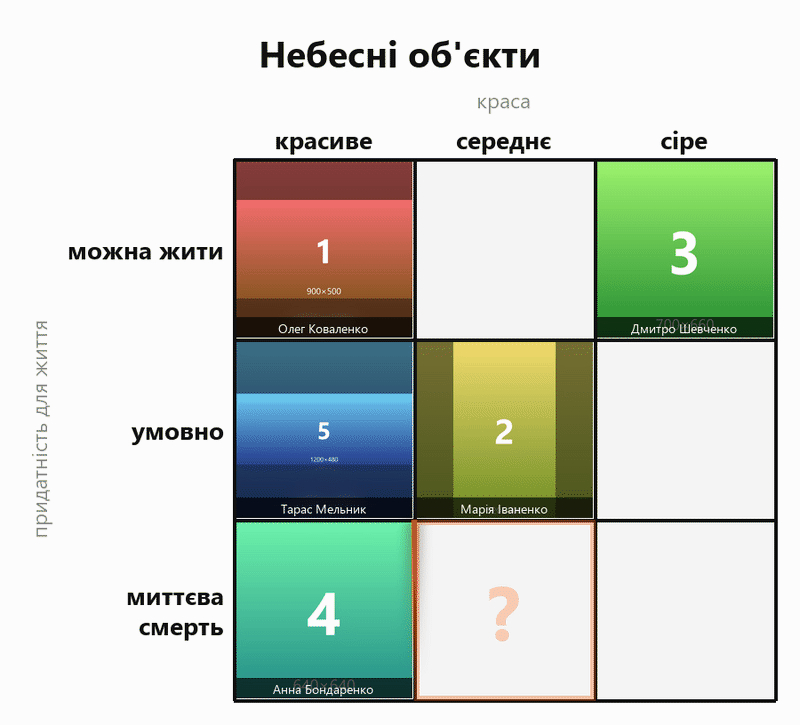

**Українська** · [English](README.en.md)

# votebot — вікторина-чарт для Telegram-каналу

Спільнота заповнює картинками чарт із комбінацій двох параметрів. Кожна клітинка —
окремий раунд: бот публікує пост із чартом і підсвіченою активною клітинкою, читачі
кидають свої картинки в коментарі й голосують реакціями за чужі. Наприкінці раунду
бот бере переможця, вставляє його картинку в клітинку й відкриває наступний раунд.



*Активна клітинка підсвічена «змійкою», що біжить периметром. Картинки в клітинках —
згенеровані заглушки з `preview.py`.*

Формат добре відомий за «alignment charts» на reddit. Уся сіль у тому, щоб осі
**антикорелювали**: потворне має бути здатним виявитися надефективним, а красиве —
провальним. Якщо осі тягнуть в один бік, заповниться діагональ, а решта клітинок
стоятиме порожньою і голосування згасне.

---

## Як це працює

**Один раунд = один пост.** Наприкінці раунду публікується новий, а попередній
видаляється — разом із ним Telegram прибирає і його гілку коментарів, тож чистити
реплаї окремо не доводиться. Кожен раунд дає підписникам нотифікацію.

**Планувальник замість демона.** `tick.py` запускається раз на хвилину, дивиться в
`state.json` і вирішує, що робити: оновити відлік, закрити раунд або нічого. Коли
вікторина завершується, стан гаситься і планувальник більше не робить нічого до
наступного `init_quiz.py`.

**Реакції накопичуються з черги апдейтів.** У Bot API немає методу «віддай лічильники
реакцій», тому бот збирає їх із пуш-апдейтів `message_reaction`. Кожен такий апдейт
містить повний набір реакцій одного користувача на одне повідомлення, тож обробка
ідемпотентна: повторний злив тієї ж пачки нічого не зіпсує. Черга на боці Telegram
живе 24 години — навіть кількагодинний простій планувальника не втратить голоси.

---

## Що потрібно

- **Python 3.10+**
- **Telegram-канал** із прив'язаною групою обговорень
- **Окремий бот**, який більше ніде не використовується (пояснення нижче)
- **ffmpeg** — необов'язково, але бажано: з ним анімація йде в mp4 (повний колір,
  ~30–50 КБ), без нього — в gif (256 кольорів помітно псують фото, файл у 5 разів більший)

---

## Встановлення

### 1. Код і залежності

```bash
git clone https://github.com/USER/votebot.git && cd votebot
python -m venv .venv
```

```bash
# Linux/macOS
source .venv/bin/activate && pip install -r requirements.txt
```

```powershell
# Windows
.venv\Scripts\Activate.ps1 ; pip install -r requirements.txt
```

На headless-Linux додатково потрібні шрифти з кирилицею і (бажано) ffmpeg:

```bash
sudo apt install -y fonts-dejavu-core ffmpeg
```

Без шрифтів Pillow візьме вбудований бітмапний і кирилиця розсиплеться.

### 2. Бот

У [@BotFather](https://t.me/BotFather):

1. `/newbot` → отримай токен
2. `/setprivacy` → обери свого бота → **Disable**

> ⚠️ **Бот має бути окремий.** Telegram дозволяє рівно один `getUpdates` на токен і
> запам'ятовує на боці сервера фільтр `allowed_updates` — той, хто виставив його
> останнім, вирішує, які типи апдейтів взагалі потраплять у чергу. Спільний токен з
> іншим застосунком дає найгірший сценарій: вікторина справно публікує раунди, але не
> отримує ані коментарів, ані реакцій, і жодної помилки в логах при цьому немає.
> `init_quiz.py` це виявляє й відмовляється стартувати.

### 3. Канал і група обговорень

- До каналу має бути прив'язана група обговорень (Налаштування каналу → Обговорення).
  Без неї коментарів фізично не існує.
- Бот — **адміністратор каналу** з правами публікувати, редагувати й видаляти.
- Бот — **адміністратор групи обговорень**. Це не косметика: Telegram надсилає апдейти
  `message_reaction` лише адміністраторам чату, тобто без цього права голоси рахувати
  буде нічим.

### 4. Як дізнатися ID каналу

Перешли будь-який пост зі свого каналу боту [@RawDataBot](https://t.me/RawDataBot) —
у відповіді знайди `forward_from_chat` → `id`. Він уже буде у правильному вигляді, з
префіксом `-100` (наприклад `-1001234567890`).

**ID групи обговорень вказувати не треба** — бот визначає його сам через `linked_chat_id`.

### 5. Конфіг і секрети

```bash
cp config.example.yaml config.yaml
cp .env.example .env
```

У `.env` впиши `BOT_TOKEN`, у `config.yaml` — `telegram.channel_id`, заголовок і підписи
осей. Обидва файли в `.gitignore`.

### 6. Перевірка

```bash
python init_quiz.py --check
```

Перевіряє конфіг, шаблони, права бота в каналі й групі, зв'язок каналу з групою і — що
найважливіше — чи бот справді **отримує** апдейти. Нічого не публікує.

Оформлення можна покрутити окремо, не запускаючи вікторину:

```bash
python preview.py --filled 6
```

---

## Запуск

Старт вікторини — один раз:

```bash
python init_quiz.py
```

Далі раунди рухає планувальник, який має ходити раз на хвилину.

### Локально (Windows / macOS / Linux)

Найпростіше — цикл у терміналі. Вікно має лишатися відкритим на весь час вікторини
(за замовчуванням це 9 годин), а комп'ютер — не йти в сон.

```powershell
# Windows PowerShell
while ($true) { python tick.py; Start-Sleep 60 }
```

```bash
# Linux/macOS
while true; do python tick.py; sleep 60; done
```

Якщо цикл обірветься, нічого не втрачається: стан лежить у `state.json`, черга апдейтів
на боці Telegram живе 24 години. Просто запусти цикл знову — відлік і закриття раундів
наздоженуть себе самі.

### На сервері: systemd (рекомендовано)

Логи лягають у journald з ротацією, керування — звичайним `systemctl`, паралельні
запуски systemd не допускає сам.

```bash
sudo cp deploy/votebot.service deploy/votebot.timer /etc/systemd/system/
sudo nano /etc/systemd/system/votebot.service   # підстав User= і шляхи
sudo systemctl daemon-reload
sudo systemctl enable --now votebot.timer
```

```bash
journalctl -u votebot -f          # живий лог
systemctl list-timers votebot.timer
```

### На сервері: cron

Простіше, але логи доведеться ротувати самому.

```bash
crontab -e
```

```
* * * * * cd /opt/votebot && /opt/votebot/.venv/bin/python tick.py >> /opt/votebot/runtime/tick.log 2>&1
```

> Тека `runtime/` має існувати **до** першого запуску: перенаправлення `>>` робить шелл
> раніше, ніж Python встигне її створити. `mkdir -p runtime`.

Паралельні запуски відсікає файловий замок `runtime/tick.lock`: якщо попередній тік ще
вантажить відео, наступний просто пропускає такт.

⚠️ **Планувальник має бути один.** Два одночасні тіки на різних машинах розтягнуть чергу
апдейтів навпіл, і кожен побачить лише частину реакцій.

---

## Команди

```bash
python init_quiz.py                 # старт
python init_quiz.py --check         # перевірка налаштувань, нічого не публікує
python init_quiz.py --dry-run       # відрендерити перший раунд і показати текст поста
python init_quiz.py --abort         # погасити активну вікторину
python init_quiz.py --force         # почати заново поверх активної
python preview.py --filled 6        # превʼю оформлення із заглушками
python simulate.py                  # офлайн-прогін усіх раундів із перевірками
```

Для тестового забігу зручно скоротити раунди:

```bash
python init_quiz.py --round-seconds 60 --caption-seconds 30 --multi-entry
```

`--multi-entry` дозволяє кілька заявок від однієї людини — щоб можна було перевірити
підрахунок голосів наодинці.

---

## Файли

| Шлях | Що це |
|---|---|
| `config.yaml` | параметри вікторини (з `config.example.yaml`) |
| `.env` | токен бота |
| `state.json` | активна вікторина; `active: false` = роботи немає |
| `runtime/offset.json` | офсет `getUpdates`, живе окремо й переживає завершення вікторини |
| `runtime/archive/<quiz_id>.json` | підсумки завершеної вікторини разом з іменами переможців |
| `media/` | згенеровані чарти й завантажені картинки переможців |

---

## Що варто розуміти про налаштування

**`vote_weight`.** Звичайний користувач Telegram може поставити одну реакцію на
повідомлення, власник Premium — до трьох. При `reaction` преміум-акаунт важить утричі
більше за звичайний; при `user` усі рівні ±1 незалежно від підписки. Для публічного
голосування чесніший `user`.

**`min_votes`.** Мінімальний скор для перемоги. При `0` виграє будь-яка заявка, навіть
без жодної реакції. При `1` і вище клітинка може лишитися порожньою — вікторина при
цьому спокійно йде далі.

**Приватність підписів.** У чарті й у списку переможців бот пише **ім'я та прізвище**,
без `@username`: підпис бачить уся аудиторія каналу, а юзернейм — це клікабельне
посилання на профіль, тобто інший рівень публічності. Сам юзернейм зберігається в
`runtime/archive/`, щоб автора можна було знайти.

**Що вважається заявкою.** Фото (зокрема з підписом) і зображення, надіслані файлом.
Гіфки, відео та стікери не рахуються: у клітинку потрібен статичний кадр. Текстові
коментарі просто ігноруються й слот заявки не витрачають.

**Емодзі.** Telegram приймає як реакції лише свій фіксований набір — кольорові сердечка
(💙 💜 💚 🧡 💖 💗) він відхиляє. Селектор варіації нормалізується, тож ❤ і ❤️ — одне й
те саме.

---

## Типові проблеми

**Бот публікує раунди, але заявок і голосів нуль.**
Найпевніше, токен використовує ще один застосунок. Перевір:
`curl -s "https://api.telegram.org/bot<TOKEN>/getWebhookInfo"` — якщо в `allowed_updates`
не ті типи, що треба, значить фільтр виставив хтось інший, і апдейти про коментарі просто
не потрапляють у чергу. Лікування — окремий бот. `init_quiz.py --check` це ловить.

**`409 Conflict: terminated by other getUpdates request`.**
Те саме: два опитувачі на один токен. Або запущено два планувальники.

**Під постами немає кнопки «Коментарі».**
До каналу не прив'язана група обговорень.

**Заявки збираються, а реакції не рахуються.**
Бот не адміністратор у групі обговорень — Telegram не надсилає йому `message_reaction`.

**Замість кирилиці квадратики.**
Немає системних шрифтів: `sudo apt install -y fonts-dejavu-core`, або вкажи
`render.font` / `render.font_bold` у конфізі.

**Замість mp4 виходить gif.**
Не знайдено ffmpeg.

**Раунд закрився пізніше за дедлайн.**
Планувальник ходить раз на хвилину й закриває раунд першим тіком після дедлайну. На
годинних раундах це похибка близько відсотка. Якщо потрібна точність — `OnUnitActiveSec=15s`.

**Відлік у підписі не оновлюється.**
`caption_update_*` менший за такт планувальника: підпис редагується лише під час тіка.

---

## Як влаштовано всередині

```
votebot/
  config.py   параметри з config.yaml + секрети з .env
  render.py   малювання чарта й анімації (жодних мережевих викликів)
  state.py    атомарне сховище стану + замок від паралельних тіків
  api.py      тонка обгортка Bot API з ретраями і обробкою flood wait
  updates.py  злив getUpdates, накопичення заявок і реакцій, підрахунок скорів
  rounds.py   життєвий цикл раунду: старт / відлік / підсумки / фінал
```

`simulate.py` проганяє повний цикл усіх раундів на заглушках, без жодного мережевого
виклику, і перевіряє те, що на живому каналі виявилося б лише за багато годин: переходи
станів, підрахунок скорів, захист від подвійного зарахування переможця, приватність
підписів і розклад оновлення відліку.

---

## Ліцензія

MIT — див. [LICENSE](LICENSE).
